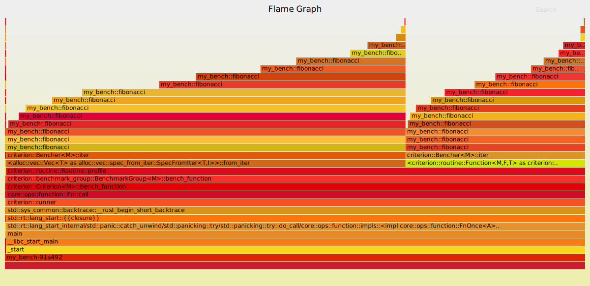

This is just a short post about something I recently discovered in the Rust ecosystem:

`Criterion` + `pprof` = 🔥

If you have a Medium subscription and want to support me, you can [read this post on Medium][medium-post].


------

**Update**: Based on this blog post, `pprof` now ships with a [custom profiler for Criterion][pprof-criterion-profiler] since version 0.4.2!
Make sure to check out [this example][pprof-criterion-example] and enable `"criterion"` and `"flamegraph"` crate features.


# Introduction

[Criterion][criterion] is a well-known and often-used benchmarking framework in the Rust ecosystem.
If you've not yet heard of it, definitely check it out!

Since `v0.3`, Criterion supports [in-process profiling hooks][profiling-hooks].
They allow us to use a custom profiler while running benchmarks.
After registering a custom profiler, we can enable them by running the benchmark suite with the `--profile-time` flag.

Having hooks for a custom profiler for your benchmarks allows you to do _awesome_ stuff, for example generating flamegraphs for every benchmark with [`pprof`][pprof].


# Background

One question I often ask myself when looking at benchmarks is:

> "These numbers are great. But how can we do this faster? Where do we spend the most time?"

This question can often be answered by looking at flamegraphs.

Previously, I got my hands dirty using [`cargo-flamegraph`][cargo-flamegraph], which is a really good tool on its own.
But the problem is that when using [`cargo-flamegraph`][cargo-flamegraph] with benchmarks, you will usually get some unnecessary clutter, e.g. the setup routine for your benchmark and the enclosing framework code from Criterion.

And here comes another cool Rust library into play: [`pprof`][pprof] with the `flamegraph` feature!

[`pprof`][pprof] is a CPU profiler that can be used to profile specific parts of your program on Linux.
The best of all: It even supports generating flamegraphs with the feature flag `flamegraph`.


Let's directly dive in and create a `pprof` integration for Criterion!


# Setup

We will now create a custom profiler for `criterion` with `pprof` that will print flamegraphs for each benchmark.

First, add the following dependencies to your `Cargo.toml`:
```toml
[dev-dependencies]
pprof = { version = "0.3", features = ["flamegraph"] }
criterion = "0.3"
# criterion-macro = "0.3"  # optional, if you use custom test frameworks
```

Now create a new file in your `benches/` folder. Let's call it `perf.rs`.
Here we will implement our new `FlamegraphProfiler`.

The interface for implementing a custom profiler is actually quite straight-forward.
We only need to implement the [`criterion::profiler::Profiler`][criterion-profiler-trait] trait from Criterion and we are good to go.


```rust
use std::{fs::File, os::raw::c_int, path::Path};

use criterion::profiler::Profiler;
use pprof::ProfilerGuard;


/// Small custom profiler that can be used with Criterion to create a flamegraph for benchmarks.
/// Also see [the Criterion documentation on this][custom-profiler].
///
/// ## Example on how to enable the custom profiler:
///
/// ```
/// mod perf;
/// use perf::FlamegraphProfiler;
///
/// fn fibonacci_profiled(criterion: &mut Criterion) {
///     // Use the criterion struct as normal here.
/// }
///
/// fn custom() -> Criterion {
///     Criterion::default().with_profiler(FlamegraphProfiler::new())
/// }
///
/// criterion_group! {
///     name = benches;
///     config = custom();
///     targets = fibonacci_profiled
/// }
/// ```
///
/// The neat thing about this is that it will sample _only_ the benchmark, and not other stuff like
/// the setup process.
///
/// Further, it will only kick in if `--profile-time <time>` is passed to the benchmark binary.
/// A flamegraph will be created for each individual benchmark in its report directory under
/// `profile/flamegraph.svg`.
///
/// [custom-profiler]: https://bheisler.github.io/criterion.rs/book/user_guide/profiling.html#implementing-in-process-profiling-hooks
pub struct FlamegraphProfiler<'a> {
    frequency: c_int,
    active_profiler: Option<ProfilerGuard<'a>>,
}

impl<'a> FlamegraphProfiler<'a> {
    #[allow(dead_code)]
    pub fn new(frequency: c_int) -> Self {
        FlamegraphProfiler {
            frequency,
            active_profiler: None,
        }
    }
}

impl<'a> Profiler for FlamegraphProfiler<'a> {
    fn start_profiling(&mut self, _benchmark_id: &str, _benchmark_dir: &Path) {
        self.active_profiler = Some(ProfilerGuard::new(self.frequency).unwrap());
    }

    fn stop_profiling(&mut self, _benchmark_id: &str, benchmark_dir: &Path) {
        std::fs::create_dir_all(benchmark_dir).unwrap();
        let flamegraph_path = benchmark_dir.join("flamegraph.svg");
        let flamegraph_file = File::create(&flamegraph_path)
            .expect("File system error while creating flamegraph.svg");
        if let Some(profiler) = self.active_profiler.take() {
            profiler
                .report()
                .build()
                .unwrap()
                .flamegraph(flamegraph_file)
                .expect("Error writing flamegraph");
        }
    }
}
```

To use the new profiler, we need to register it with Criterion.
See also [Criterion's advanced configuration][criterion-config].

If you are using the [custom test framework feature][criterion-custom-test-framework] with `criterion-macro`, you can configure it with:

```rust
#![feature(custom_test_frameworks)]
#![test_runner(criterion::runner)]

use criterion::{Criterion, black_box};
use criterion_macro::criterion;

mod perf;


fn fibonacci(n: u64) -> u64 {
    match n {
        0 | 1 => 1,
        n => fibonacci(n - 1) + fibonacci(n - 2),
    }
}


fn custom_criterion() -> Criterion {
    Criterion::default().with_profiler(perf::FlamegraphProfiler::new(100))
}

#[criterion(custom_criterion())]
fn bench_custom(c: &mut Criterion) {
    c.bench_function("Fibonacci-Custom", |b| b.iter(|| fibonacci(black_box(20))));
}
```

Else, you can do it like:

```rust
mod perf;

criterion_group!{
    name = benches;
    // This can be any expression that returns a `Criterion` object.
    config = Criterion::default().with_profiler(perf::FlamegraphProfiler::new(100);
    targets = bench
}
```

Now that we have set up our custom profiler we can actually use it for our benchmarks as described in the next section.


# Running the Benchmarks and Getting Results

## Enable Performance Profiling for Unprivileged Users
To enable performance profiling without running the benchmarks as root, you may need to adjust the value of `perf_event_paranoid` in the Linux kernel to an appropriate value for your environment. The most permissive value is `-1`.
```bash
echo -1 | sudo tee /proc/sys/kernel/perf_event_paranoid
```

## Running the Benchmarks
Now that everything is set up, we can run our benchmark with 
```bash
cargo bench --bench my_bench -- --profile-time=5
```
This command will run the benchmarks in `benches/my_bench.rs` for 5 seconds with the use of our custom `FlamegraphProfiler`.

> Note: You need to specify the name of your benchmark because otherwise you might get the error `Unrecognized option: 'profile-time'`.
> See also [`cargo bench` gives "Unrecognized Option" errors for valid command-line options][criterion-unrecognized-option].


## Viewing the Flamegraph

We will now find a file called `flamegraph.svg` in `target/criterion/<name-of-benchmark>/profile/flamegraph.svg`.

For the above example, we get the following result:


Cool feature. I really like it 😊


[criterion]: https://github.com/bheisler/criterion.rs
[profiling-hooks]: https://bheisler.github.io/criterion.rs/book/user_guide/profiling.html#implementing-in-process-profiling-hooks
[cargo-flamegraph]: https://github.com/flamegraph-rs/flamegraph
[pprof]: https://crates.io/crates/pprof
[criterion-config]: https://bheisler.github.io/criterion.rs/book/user_guide/advanced_configuration.html
[criterion-custom-test-framework]: https://bheisler.github.io/criterion.rs/book/user_guide/custom_test_framework.html
[criterion-unrecognized-option]: https://bheisler.github.io/criterion.rs/book/faq.html#cargo-bench-gives-unrecognized-option-errors-for-valid-command-line-options
[criterion-profiler-trait]: https://docs.rs/criterion/*/criterion/profiler/trait.Profiler.html
[medium-post]: https://jibbow.medium.com/automatic-flamegraphs-for-benchmarks-with-criterion-f8e59499cc2a
[pprof-criterion-profiler]: https://docs.rs/pprof/0.4.2/pprof/criterion/struct.PProfProfiler.html
[pprof-criterion-example]: https://github.com/tikv/pprof-rs/blob/v0.4.2/examples/criterion.rs
