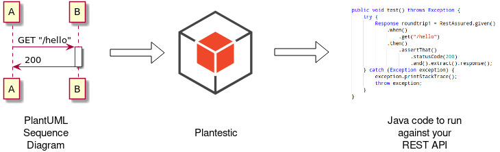
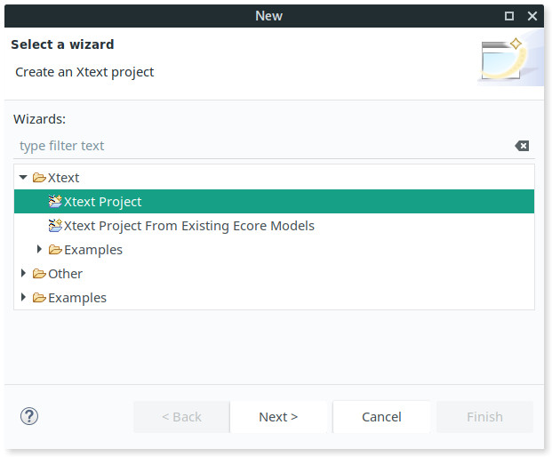
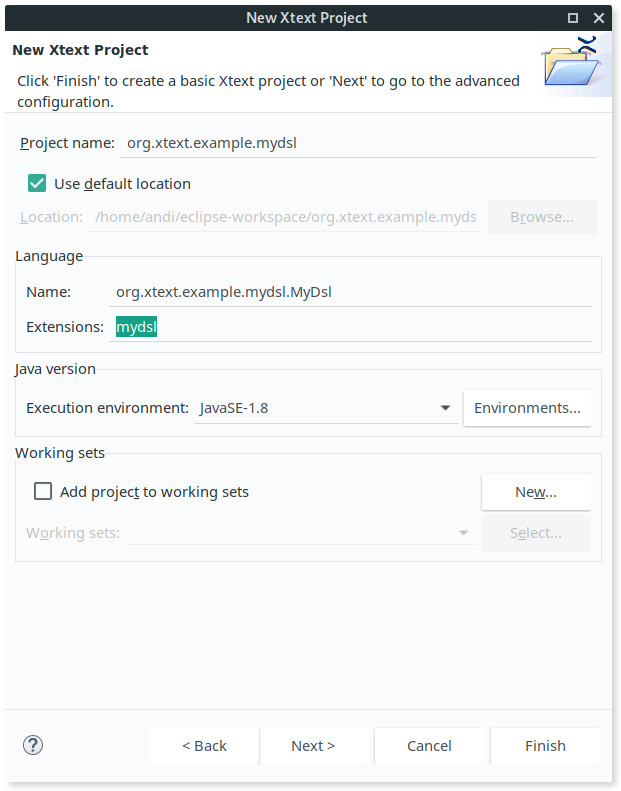
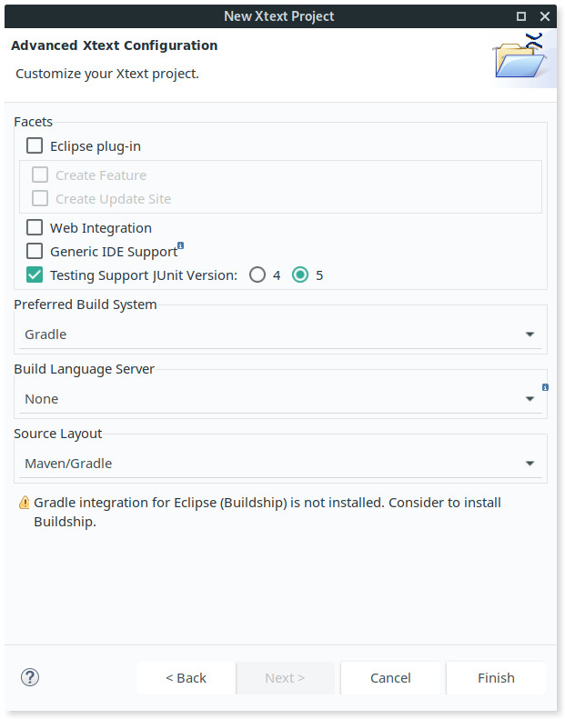

# Introduction and Overview

# Prerequisits for this Tutorial 🎓
This tutorial assumes that you already know the basics of [EMF][emf-overview], [Xtext][xtext], [QVT][qvt-o] and [Acceleo][acceleo].
It's also good if you know some basic stuff about Ecore (see [its documentation][ecore-docs]) and metamodels (the backbone of EMF).
See the [EMF tutorial][emf-tutorial] to get you started with the basic concepts.

# Project Background
During the development of "[Plantestic][plantestic-github]" we were facing the following problem:
We wanted to make use of the large [EMF ecosystem][emf-transformations] but we didn't want to force anybody who was using "Plantestic" into using Eclipse.

A short overview on what "Plantestic" does to give you are rough idea if this is the right blog post for you:

Plantestic allows you to convert UML Sequence Diagrams into tests for your REST API.
Most of the time when companies use contractors for their projects, they also include UML sequence diagrams for specifying the project's API.
When the project is done, they quickly want to test the result against the specification but this costs additional time and money to do so.
Therefore, it is desirable to generate API tests based on the specification.
We actually did this project for a large company who approached us with exactly this problem and they were very happy with the final result.
You can find the project [on GitHub][plantestic-github].



Plantestic is doing the following steps to generate test cases:

 1. Parse a UML sequence diagram written with [PlantUML][plantuml]. 
    The advantage of using PlantUML is that it is very easy for the user to quickly create UML diagrams.
    The downside is that the resulting diagrams hardly follow the official UML standard by means of semantics and they also only "look like" UML diagrams but they lack a lot of information that is usually provided when using real UML.
    But customer first means: don't force them into using something they don't need!  
    We use [Xtext][xtext] to create a parser for "our custom DSL" (=PlantUML syntax) because this gives us an output in the ECore format which allows us to easily integrate it with other EMF tools.
 2. Because the output of Xtext is highly specific to PlantUML, we want to transform the diagram in a very generic intermediate representation.
    Think "getting rid of arrows and colors and use only their semantic information like 'what is a request'".
    We use again a tool from the EMF ecosystem: [QVT-operational][qvt-o].
 3. Now we want to transform the very generic intermediate representation into a very specific output representation.
    Think "From semantically rich meta-objects to concrete Java classes".
    We again use QVT for this.
 4. Now generate actual source code for the tests from the model.
    Because we did step (3) this is very straight forward.
    We use [Acceleo][acceleo] from the EMF world to do this.

All in all we use the tools Xtext, QVT-o and Acceleo from the EMF ecosystem to generate source code from a given UML sequence diagram.
However, all these tools are heavily integrated into Eclipse (I mean, there is a reason why EMF stands for "Eclipse Modelling Framework").
Nevertheless, we wanted to develop a standalone tool which was easy to use for our end-users without forcing them to install Eclipse.

It took us some sleepless nights and we dug deep through undocumented source code until we figured out every single step needed to make all this work.
In the end, the solution does actually not require that many lines of code.
By publishing this post I hope to save you from some days of headage.
Enjoy the journey!

## Why EMF?
[TODO: should I even include this section?]

## Current Workflow with EMF and Xtext, QVT-o and Acceleo

# Reasons why you want to do This
Maybe the big elephant in the room is:
"Why should you even do this?
For years it was good enough to use Eclipse for this.
It gives you a lot of features and does everything for you.
Why should we stop using Eclipse for doing EMF projects?" 

Well, in our specific case the answer is quite easy:
We want to develop a standalone tool because our user is not interested in the technology behind it.
However, even if this is not a compelling reason for you, there are several others:

 - **Programmatically Invoke the Pipeline with full Control**:
   You can run the transformation pipeline from within your existing code and you have full control over it.
 - **Automated Tests**:
   You can easily write tests (e.g. with JUnit) to check your transformations.
   Specify an input, do the transformation step, check the output.
   You should always write tests for your code 😋
 - **CI-Pipeline**:
   When following the two points above, you have a nice integration into your build pipeline.
   `gradle check` now builds your parser, checks the parser, checks the transformations and checks the output model.
   Nothing else is required.
 - **End-To-End Tests**:
   We were able to write some very nice End-To-End tests for "Plantestic":
   Take a `.puml` file, run the transformation pipeline on it, _dynamically compile the resulting source code_ during the test, spin up a configured mock server and run the generted test case against the mock server!
   Gosh, this is really what we needed during the project to check that everyhting works as expected!
 - **No IDE lock-in**:
   This is pretty much self-explanatory: This approach does not require any specific IDE (=Eclipse).


# Limitations (Or: Reasons why you don't want to do This)
The benefits of integrating Xtext, QVT-o and Acceleo directly into your build pipeline also comes with a few drawbacks:

 - **No Syntax Highlighting**:
   This is only a minor one, but when working with Xtext grammar (`.xtext`), QVT-o transformations (`.qvto`) or Acceleo templates (`.mtl`) you have no syntax highlighting.
   However, you can circumwent this problem by using Eclipse with the corresponding EMF plugins for editing.
 - **No Auto-Completion**:
   Because we gave up the dependency on Eclipse we also don't get the benefit of automagical auto-completion.
   We could not find a way of enabling auto-completion when editing the transformation files with Eclipse; however it should be possible in theory.
 - **No fat-JAR (yet)**:
   Wait, what? Did I really just say that?
   Yes, but hold back! This is just an issue we encountered with Acceleo.
   Xtext and QVT work just fine when bundling them into a fat jar.
   Why does Acceleo prevent us building a fat JAR?
   Well, when executing an Acceleo transformation, there is still one intermediate step involved, namely compiling the `.mtl` file to an `.emtl` file.
   Because we are doing this at runtime, it is not distributed within the JAR archive.
   But behold, there are silver lining on the horizon:
   The nicest solution would be to write a gradle task that compiles the `.mtl` file to an `.emtl` file at build time and packages it within the JAR archive.


# How we achieved our Goals 🏆

Below you'll find an excerpt of our `build.gradle` with a list of all required dependencies for QVT and Acceleo.
Most of them are directly from the Eclipse repository.
To include the Eclipse repository you need to add `maven { url "https://repo.eclipse.org/content/groups/releases/" }` under the `repositories` section in your `build.gradle`.
You also need to include `maven { url "https://dist.wso2.org/maven2/" }` for the other dependencies.

<script src="https://gist.github.com/Jibbow/ae7bcae6b0d74e119d718a3080086e65.js"></script>


## Xtext as a Parser for your Domain Specific Language (DSL)

To give you an overview, the following three steps need to be done:

 1. Generate a new Xtext project which builds the parser and the `.ecore` metamodel files for your DSL
 2. Merge the resulting Xtext project with our main project by creating a "subproject" for the DSL.
 3. Add some lines of code to your original project to initialize and call the Xtext parser


### 1. Create a new Xtext project from Scratch

[Eclipse Modeling Tools 2018-09][eclipse-download] -> do we need modeling tools or is normal eclipse also okay?


I am now going to explain step-by-step how to create a new Xtext project from scratch. But feel free to clone the corresponding parts of "Plantestic".

First, install the Xtext plugin: Go to `Help → Eclipse Marketplace` and search for "Eclipse Xtext". We used version 2.18.0 of the Xtext plugin.

Now, we can create a new Xtext project with the wizard. To do this, open `File → New → Other...` and choose "Xtext Project" as in the following screenshot:



Click "Next" and the wizard will ask you for your project name and the name of your DSL:



Again, click "Next" and now here comes the interesting part:  
Untick the checkbox "Eclipse plug-in" and choose "Gradle" as your preferred build system. 
Furthermore, you probably want to choose "Maven/Gradle" for the source layout.  
If you want to generte a language server for your DSL, check "Generic IDE Support".
I will not cover language servers in this post.



Now click finish and the wizard will create two gradle projects for you: A parent project and the actual DSL in its own project.

Run `./gradlew check` in the parent project to ensure everything works.
This gradle task also generates the `MyDsl.ecore`.

When you open the inner project under `org.xtext.example.mydsl.parent/org.xtext.example.mydsl/` you will find the following structure:


I highlighted three files that are important:

 - `MyDsl.ecore`: This file contains the metamodel of our DSL.
   The file is generated and you should never touch this.
   Later on, we will need to register this metamodel in the `EPackage.Registry`.
   I will cover this further down.
 - `GenerateMyDsl.mwe2`: This file describes the workflow how the language artifacts are built.
   MWE stands for "Modeling Workflow Engine".
   Here you can specify the settings you did with the wizard in the previous step and many other settings for your language as well.
 - `MyDsl.xtext`: This file contains the actual grammar.

We encountered the problem, that our grammar was too large and thus could not be built.
To fix this issue, we had to add the following lines of code to the `.mwe2` file:
```
parserGenerator = {
  antlrParam = "-Xconversiontimeout"
  antlrParam = "40000"
  options = {
    ignoreCase = true
    backtrack = true
    memoize = true
    classSplitting = true
    fieldsPerClass = "300"
    methodsPerClass= "800"
  }
}
```
The original discussion of this problem can be found here [in this post on the Eclipse forum](https://www.eclipse.org/forums/index.php/t/1086458/).
Also have a look at [our mwe2 file][plantestic-mwe2].

All in all, we now have an Xtext parser being built with Gradle!


### 2. Create a Subproject in your Project that will contain the Xtext Parser

We now need to integrate the newly created Xtext project into your existing project.

### 3. Invoke the Xtext Parser from your Source Code

Invoking the parser now is relatively straight forward now, but there is a lot of non-obvious magic happening in the background.

In a nutshell:

 1. Register `ecore` and `xmi` factories in the global `EPackage.Registry`.
 2. Register the metamodel of your language associated with the right `nsURI` in the `EPackage.Registry`.
 3. Create a new `ResourceSet` and load the file you want to parse into it.
 4. Resolve cross-references from your file (if you have any)

#### Register the Factories for the Metamodels

Luckily, step 1. and 2. are super simple because the Xtext generator actually generates a method for us that we simply need to call.

```kotlin
import mydsl.MyDslStandaloneSetup

fun main() {
  // call the setup function generated by xtext
  MyDslStandaloneSetup.doSetup()
}
```

You can find the generated method in `mydsl/src/main/xtext-gen/MyDslStandaloneSetupGenerated.java`.

For now, it is not important on what it does.
However, when we later come to QVT-o transformations, we need to register own metamodels in the registry.

#### Load the Contents of the File and Parse it
Step 3 is also just two lines of code:

```kotlin
import mydsl.MyDslStandaloneSetup

fun main() {
  // call the setup function generated by xtext
  MyDslStandaloneSetup.doSetup()

  // create a new ResourceSet and pass the URI of the file we want to load
  val uri = URI.createFileURI(fileToParse)
  val resource = ResourceSetImpl().getResource(uri, true)
}
```

Parsing happens on-the-fly by just creating a `ResourceSet`.
Based on the extension, the resource set decides which `ResourceFactory` it should use for generating a model.
This is the reason why we had to register the `ResourceFactory` first by invoking `doSetup()`.

We now have a `Resource` that contains a list of `EObjects` in `resource.contents`.
And `EObjects` are the things we want after parsing the file! 🤩

#### Print the Model of the parsed File

For debugging, you might want to print the Ecore model that represents the contents of the parsed file.
This can be done with the following method:

```kotlin
fun main() {
  // call the setup function generated by xtext
  MyDslStandaloneSetup.doSetup()

  // create a new ResourceSet and pass the URI of the file we want to load
  val uri = URI.createFileURI(fileToParse)
  val resource = ResourceSetImpl().getResource(uri, true)

  printModel(resource.contents[0])
}


fun printModel(model: EObject) {
  val resource = ResourceSetImpl().createResource(URI.createURI("dummy:/test.ecore"))
  resource.contents.add(model)

  resource.save(System.out, null)
}
```

What the heck is going on here?
Well, we need to create a new `ResourceSet` that now contains corresponds to the `ecore` format instead of `mydsl`.
Therefore, the default `EcoreResourceFactory` is used.
Again, this only works because we registered the appropriate factory together with the string `"ecore"` in the `doSetup()` function at the beginning.
Furthermore, we don't need an actual file because all of this happens in-memory.
However, a `ResourceSet` requires a valid `URI` as an identifier.
So we just pass a dummy URI to it.
The only requirement is that the extension is `.ecore`.

Then we add the existing model of our parsed file and save it to `STDOUT`.


#### Resolving Cross-References

When you use the provided method to print the model, you might notice that there are _absolute file paths_ in it.
This happens when you used [cross-references in your Xtext grammar][xtext-cross-refs].

The following is an example from Plantestic with unresolved cross-references. Note the lines with `"file:/home/plantestic/..."`:

```xml
<?xml version="1.0" encoding="UTF-8"?>
<puml:UmlDiagram xmi:version="2.0" xmlns:xmi="http://www.omg.org/XMI" xmlns:xsi="http://www.w3.org/2001/XMLSchema-instance"
    xmlns:puml="http://www.eclipse.plantuml/Puml">
  <umlDiagrams xsi:type="puml:SequenceUml">
    <umlElements xsi:type="puml:Participant" name="A"/>
    <umlElements xsi:type="puml:Participant" name="B"/>
    <umlElements xsi:type="puml:UseLeft" userOne="file:/home/plantestic/core/build/resources/test/minimal_hello.puml#|0"
        userTwo="file:/home/plantestic/core/build/resources/test/minimal_hello.puml#|1">
      <content xsi:type="puml:Request" method="GET" url="/hello"/>
    </umlElements>
    <umlElements xsi:type="puml:Activate" activate="file:/home/plantestic/core/build/resources/test/minimal_hello.puml#|2"
        deactivate="file:/home/plantestic/core/build/resources/test/minimal_hello.puml#|3">
      <umlElements xsi:type="puml:UseLeft" userOne="file:/home/plantestic/core/build/resources/test/minimal_hello.puml#|4"
          userTwo="file:/home/plantestic/core/build/resources/test/minimal_hello.puml#|5">
        <content xsi:type="puml:Response">
          <code>200</code>
        </content>
      </umlElements>
    </umlElements>
  </umlDiagrams>
</puml:UmlDiagram>
```

This is not what we actually want.
We still need to resolve the cross-references in our `Resource`:

```kotlin
fun main() {
  // call the setup function generated by xtext
  MyDslStandaloneSetup.doSetup()

  // create a new ResourceSet and pass the URI of the file we want to load
  val uri = URI.createFileURI(fileToParse)
  val resource = ResourceSetImpl().getResource(uri, true)

  // resolve cross references
  EcoreUtil.resolveAll(resource)

  printModel(resource.contents[0])
}
```

When we now print the the model again, all cross-references should be properly resolved:

```xml
<?xml version="1.0" encoding="UTF-8"?>
<puml:UmlDiagram xmi:version="2.0" xmlns:xmi="http://www.omg.org/XMI" xmlns:xsi="http://www.w3.org/2001/XMLSchema-instance"
    xmlns:puml="http://www.eclipse.plantuml/Puml">
  <umlDiagrams xsi:type="puml:SequenceUml">
    <umlElements xsi:type="puml:Participant" name="A"/>
    <umlElements xsi:type="puml:Participant" name="B"/>
    <umlElements xsi:type="puml:UseLeft" userOne="#//@umlDiagrams.0/@umlElements.0"
        userTwo="#//@umlDiagrams.0/@umlElements.1">
      <content xsi:type="puml:Request" method="GET" url="/hello"/>
    </umlElements>
    <umlElements xsi:type="puml:Activate" activate="#//@umlDiagrams.0/@umlElements.1"
        deactivate="#//@umlDiagrams.0/@umlElements.1">
      <umlElements xsi:type="puml:UseLeft" userOne="#//@umlDiagrams.0/@umlElements.1"
          userTwo="#//@umlDiagrams.0/@umlElements.0">
        <content xsi:type="puml:Response">
          <code>200</code>
        </content>
      </umlElements>
    </umlElements>
  </umlDiagrams>
</puml:UmlDiagram>
```


Yeah, we can now parse a file with Xtext! 🎉


## QVT-o for Model-To-Model Transformations

## Acceleo for Model-To-Text Transformations

# Conclusion ⚖️
Yes, it is possible to have a nice build pipeline with EMF-Tools!
And in hinsight it is not even that complicated after you figured out how to do it.
The downside is that there is almost no documentation available on doing this and most resources assume you have everything running inside Eclipse.
Nevertheless, we created a quite robust way of integrating these three tools in our pipeline with full control over the workflow, which is quite nice.

If you intend to use one of the frameworks covered in this post, I strongly recommend you to follow our approach as this gives you the advantages of automated tests, an good integration into your build pipeline and an easy-to-understand workflow for new developers without the need of using Eclipse.

The downside of this approach is that you don't get the benefits of a full IDE integration: no syntax highlighting and no auto-completion while working on QVT-o transformations or Acceleo generations.


[plantestic-github]: https://github.com/FionaGuerin/plantestic "Plantestic"
[plantestic-gradlefile-qvt]: https://github.com/FionaGuerin/plantestic/blob/master/core/build.gradle#L74 "Making QVT work without Eclipse"
[plantestic-gradlefile-acceleo]: https://github.com/FionaGuerin/plantestic/blob/master/core/build.gradle#L91 "Making Acceleo work without Eclipse"
[plantestic-gradlefile-repositories]: https://github.com/FionaGuerin/plantestic/blob/master/core/build.gradle#L52 "Additional Maven Repositories"
[plantestic-xtext-project]: https://github.com/FionaGuerin/plantestic/tree/master/plantuml "The Xtext sub-project"
[plantestic-root-gradlefile]: https://github.com/FionaGuerin/plantestic/blob/master/build.gradle "The root build.gradle"

[standalone-xtext]: http://www.davehofmann.de/different-ways-of-parsing-with-xtext/ "Standalone Xtext"
[java-invoke-qvt]: https://wiki.eclipse.org/QVTOML/Examples/InvokeInJava "Invoke QVT-o from Java"

[emf-overview]: https://www.eclipse.org/modeling/emf/ "EMF Overview"
[emf-transformations]: https://www.eclipse.org/modeling/transformation.php "EMF M2M Transformation Technologies"
[qvt-o]: https://projects.eclipse.org/projects/modeling.mmt.qvt-oml "QVT-operational"
[atl]: https://projects.eclipse.org/projects/modeling.mmt.atl "ATL"
[acceleo]: https://www.eclipse.org/acceleo/ "Acceleo Model-To-Text"
[xtext]: https://www.eclipse.org/Xtext/ "Xtext Parser Generator"
[xtext-cross-refs]: https://ddk.tools.avaloq.com/scope_guide.html "Xtext Cross-References"
[ecore-docs]: https://download.eclipse.org/modeling/emf/emf/javadoc/2.9.0/org/eclipse/emf/ecore/package-summary.html#details "Ecore Documentation"
[emf-tutorial]: https://eclipsesource.com/blogs/tutorials/emf-tutorial/ "EMF Tutorial"

[plantuml]: http://plantuml.com/ "PlantUML"

[eclipse-download]: https://www.eclipse.org/downloads/packages/release/2018-09/r/eclipse-modeling-tools "Eclipse Modeling Tools - Download"
[mwe2]: https://help.eclipse.org/kepler/index.jsp?topic=%2Forg.eclipse.xtext.doc%2Fcontents%2F118-mwe-in-depth.html "Modeling Workflow Engine 2"
[plantestic-mwe2]: https://github.com/FionaGuerin/plantestic/blob/master/plantuml/src/main/java/plantuml/GeneratePumlLanguage.mwe2 "mwe2 file of Plantestic"
